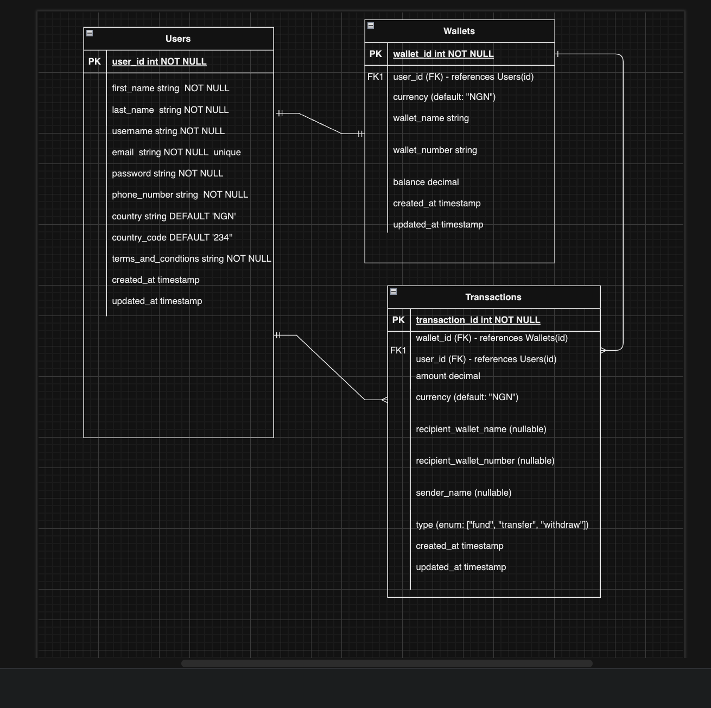

# Demo-credit Backend Project

- Demo Credit is a mobile lending app that requires wallet functionality. This is needed as borrowers need a wallet to receive the loans they have been granted and also send the money for repayments

---

## Requirements

For development, you will only need Node.js (version 14 and above) and a node global package installed in your environment.

- User account creation
- Funding of user accounts
- Transfer of funds between user accounts
- Withdrawal of funds from user accounts
- Blacklist check during onboarding

### Node

- #### Node installation on Windows

    Just go on [official Node.js website](https://nodejs.org/) and download the installer.
    Also, be sure to have `git` available in your PATH, `npm` might need it (You can find git [here](https://git-scm.com/)).

## Application Project Installation

    $ git clone https://github.com/cj-prince/Demo-credit.git
    $ cd Demo-credit
    $ npm install

---

## Configure app

create a  `.env` file to the root folder then add url to your db to connect your postgres DBs. 
An example of the structure of the `.env` is seen in `.env.example` file.

---

## Project Structure
The folder structure of this app is explained below:

| Name | Description |
| ------------------------ | --------------------------------------------------------------------------------------------- |
| **migrations**           | Contains the migration files  |
| **node_modules**         | Contains all  npm dependencies     |
|     **modules**              | Contains modules for the application |
|     **config**           | Contains application configurations including environment-specific configurations 
|     **shared**              | Contains shared directories used by various modules across the applications.|
|     **routes**         | Contains routes for all modules, and also route versioning |
| **index.ts**             | Entry point to express app      |
| **tests**                | Contains all integration and unit test codes                         |
| **eslintrc.json**        | Config settings for eslint code style checking    |
| **database.json**        | Contains databases url            |
| **package.json**         | Contains npm dependencies as well as build scripts  |  
| **README.md**            | Contains details on how to setup the project locally and the codebase overview  | 
| **.babelrc**             | Contains the config for Babel preset | 
| **.env.example**         | Contains keys of the necessary environment variables needed in the .env file  |
| **.gitignore**           | Contains files and folders that github should ignore when pushing code to github  |
| **.eslintignore**        | Contains files and folders that eslint should ignore when `npm run lint` is invoked  |

---

## Running the scripts
All the different build steps are arranged via npm scripts.
Npm scripts basically allow us to call (and chain) terminal commands via npm.

| Npm Script                | Description                                                                                       |
| ------------------------- | ------------------------------------------------------------------------------------------------- |
| `dev`                     | Runs build in the local development environment. Can be invoked with `npm run dev` |
| `test`                    | Runs tests using mocha. Can be invoked with `npm run test`  (not available yet)      |
| `start`                   | Runs build in the staging development environment. Can be invoked with `npm run start`                      |

---
## Postman API Documentation
https://app.getpostman.com/join-team?invite_code=06a84e868d7454960b970fc354920b69&target_code=1cec8d5c779b1c6d28682a56da9e49c3
___

## Technologies

- NodeJS
- ExpressJS
- TypeScript
- KnexJS
- mySQL

---

E-R Diagram 

## Copyright

Copyright (c) 2024 cj-prince

---

